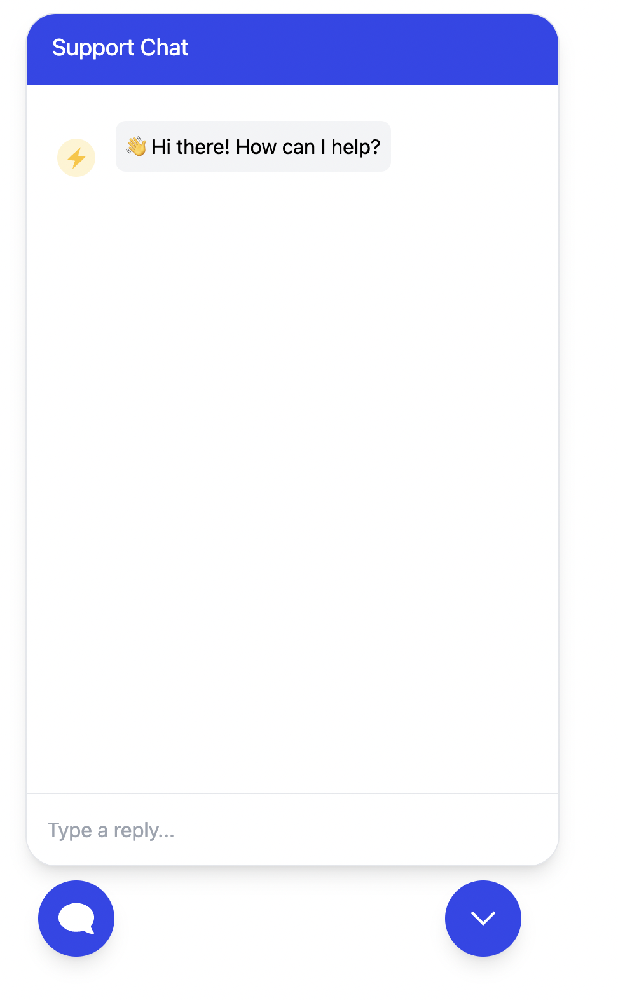

# React Chat Popup App

## Project Overview

This is a React + TypeScript project featuring a fully functional chat popup component. The chat interface allows users to toggle the chat window, send messages, and receive simulated bot responses with smooth animations and dynamic message rendering.

## Installation

Follow these steps to set up and run the project locally:

1. **Clone the repository:**

```bash
git clone https://github.com/SavanKumar8/react-chat-app.git
```

2. **Navigate to the project directory:**

```bash
cd react-chat-app
```

3. **Install dependencies:**

````bash
npm install

4. **Start the development server:**

```bash
npm start


The app will open at [http://localhost:3000](http://localhost:3000).

## 📦 Dependencies

The project uses the following dependencies:

- **React**: UI library for building components.
- **TypeScript**: Strongly typed superset of JavaScript.
- **Tailwind CSS**: Utility-first CSS framework for styling.

##  Features

- **Chat Popup**: Toggleable chat window.
- **Dynamic Messaging**: Supports user and bot messages.
- **Animations**: Smooth open/close transitions.
- **Timestamp and Seen Indicators**: Displays message timestamps and seen status.
- **TypeScript**: Ensures type safety and clean code.

##  Project Structure

```
/src
  ├── assets
  │   ├── arrow-down.svg
  │   ├── chat-icon.svg
  │   └── sender.svg
  ├── components
  │   └── ChatPopup.tsx
  ├── index.css
  ├── index.tsx
  └── App.tsx
```

Happy coding!
````
